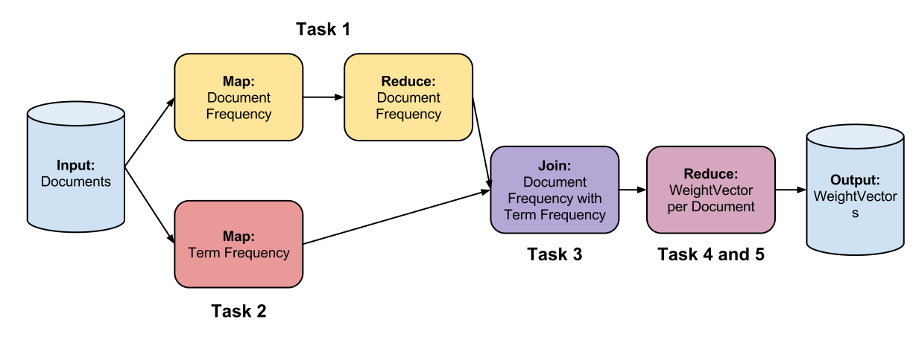
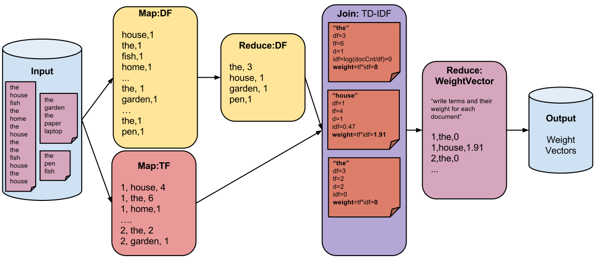

--- 
layout: inner_complex
title:  "Summit 2013: Hands-on Session"
links: 
  -       { anchor: scala-introduction, title: "Scala Intro"}
  -       { anchor: scala-programming, title: "Stratosphere & Scala"}
  -       { anchor: overview, title: "Assignment"}
  -       { anchor: task1, title: "1: Document Frequency" }
  -       { anchor: task2, title: "2: Term Frequency" }
  -       { anchor: task3, title: "3: Join" }
  -       { anchor: task4, title: "4: WeightVector per Document" }
---

<p id="handson_session"><h1>Hands-on session: Data analysis with Stratosphere</h1>

<p>This session will introduce the attendants to the Scala language and
then go through example data analysis jobs using the Scala interface
of the Stratosphere platform. The attendants will have the opportunity
to develop Stratosphere programs with the help of the Stratosphere
team and get familiar with the basic operations of Big Data analysis
using Stratosphere.</p>

### Detailed Schedule

**15:30 - 16:30 Development Environment Setup**

<p>The attendants will be provided a virtual machine that includes all
the software that will be needed in the hands on session. To expedite
the installation process, the attendants are advised to have already
installed the latest version of
<a href="https://www.virtualbox.org/">VirtualBox</a>. USB keys with
the virtual machines and the VirtualBox software will also be
available.</p>

**16:00 - 17:00 Part I: Introduction to the Scala Programming Language**

<p>This session will cover the basic aspects of
the <a href="http://www.scala-lang.org/">Scala language</a> and will
serve as a basis for all the sessions to follow. </p>

**17:00 - 18:30 Part II: Scalable data analysis with Stratosphere**

### Hands-On setup

If you don't want to use the provided VM you can check out the hands-on exercise code from
[https://github.com/stratosphere/stratosphere-summit](https://github.com/stratosphere/stratosphere-summit).
It comes as a maven project that you can import from Eclipse or Intellij. Or you could just use any text
editor and use the provided scripts (for example `./run-task1.sh`) to compile and run the examples.


<section id="scala-introduction">
## Part I: Scala Introduction
<iframe src="https://docs.google.com/presentation/d/1mzhjO-hb_ZNTHPaPiGPWDRyYufOig2CwNysW57eyQLU/embed?start=false&loop=false&delayms=3000" frameborder="0" width="800" height="400" allowfullscreen="true" mozallowfullscreen="true" webkitallowfullscreen="true"></iframe>


<a href="scala-cheatsheet.html" class="btn btn-info btn-lg" style="width:12em">
<i class="icon-align-justify"> </i> Scala Cheatsheet</a>

<br/>
<br/>
<br/>
<br/>
</section>


<section id="scala-programming">
## Part II: Stratosphere programming in Scala
<iframe src="https://docs.google.com/presentation/d/1OL3vlQ1HjE0lmC_dZp5mEveFuybd8RzkRBvEky77Ff4/embed?start=false&loop=false&delayms=3000" frameborder="0" width="800" height="400" allowfullscreen="true" mozallowfullscreen="true" webkitallowfullscreen="true"></iframe>
<br/>
<br/>
<br/>
<br/>
</section>


## Assignment: Information Retrieval using Stratosphere
<section id="overview">
### Overview

In this programming assignment, you are going to compute
[tf-idf](http://en.wikipedia.org/wiki/Tf%E2%80%93idf) using
Scala. We will show you how to write Stratosphere Operators in Scala in the
respective subtasks.

The following figure gives an overview of what we are going to do in each task:



The following figure gives some details on what each tasks performs:


<br/>
<br/>
<br/>
<br/>
</section>

<section id="task1">
### Task 1: Document Frequency
<div class="progress">
  <div class="progress-bar" role="progressbar" aria-valuenow="60" aria-valuemin="0" aria-valuemax="100" style="width: 1%;">
    <span class="sr-only">1% Complete</span>
  </div>
</div>

You are first going to calculate the document frequency. That is, in how many
documents each distinct word occurs. So if a document contains a word three
times, it is counted only once for this document. But if another document
contains the word as well, the overall frequency is two.

Besides this, you need to do some data cleansing on the input data. That is,
accept only terms (words) that are alphanumerical. There is also a list of
stopwords (provided by us) which should be rejected.

To achieve this, you need to implement a Mapper and a Reducer. The input file is
a regular text file that contains a line for each document. The schema of the
input file looks like this: ` docid, document contents ` The Mapper is
called with the documents. So each call of the user function gets one line
(e.g. a document).

In Scala a lot of things can be accomplished by stringing together operations
on collections.
(See [here](http://docs.scala-lang.org/overviews/collections/introduction.html)
for a very good introduction to the Scala collections library.)
So in this case you would first split the line into the document id and the
actual document text. Then you should split and document text into words, this
gives you a collection of strings on which you can then apply operations to
arrive at your final result. The final result should be a collection of tuples
of `(word, 1)` where every word is only represented once, even if it occurs
several times in the document.

Keep in mind that you can transform any collection into a set using
`toSet`, thereby eliminating duplicates. A set is also a collection which
can be returned from a map operation.

Use the provided `main()` method to test your code.

Task #1 is quite similar to the classical WordCount example, which is something
like the "Hello World" of Big Data.
<br/>
<br/>
<br/>
<br/>
</section>


<section id="task2">
### Task 2: Term Frequency
<div class="progress">
  <div class="progress-bar" role="progressbar" aria-valuenow="60" aria-valuemin="0" aria-valuemax="100" style="width: 20%;">
    <span class="sr-only">20% Complete</span>
  </div>
</div>

Implement a second Mapper that also reads in the documents from the same file. 
This time, the output tuples shall look like this `(docid, word, frequency)`.

The code required for this is very similar to the code for Task 1. This time,
though, you have to accumulate a count for the words in some sort of
Map structure. The output of this operation should be a collection of tuples
of `(docId, word, count)`.
<br/>
<br/>
<br/>
<br/>
</section>


<section id="task3">
### Task 3: Join

<div class="progress">
  <div class="progress-bar" role="progressbar" aria-valuenow="60" aria-valuemin="0" aria-valuemax="100" style="width: 40%;">
    <span class="sr-only">40% Complete</span>
  </div>
</div>

This task uses a new operator: Join. It has two inputs, namely the outputs from
the previous tasks. We often refern to them as the left input and the right
input.

The user code gets to inputs, namely a record from the left and a record from
the right. So the join operation looks like this:

```javascript
val  tfIdf = documentFrequencies
  .join(termFrequencies)
  .where { ... }
  .isEqualTo { ... }
  .map { (left, right) =>
        ...
  }
```
Where left is a tuple of `(word, freq)` and right is a tuple of
`(docId, word, freq)`. Keep in mind that you can neatly extract from
tuples using:

```javascript
val (word, freq) = left
```

The following pseudo code describes what your operator implementation must do
to compute the tf-idf.

```javascript
join( (word, df), (docid, word, tf)) {
    tf_idf(word) = tf * log [Util.NUM_DOCUMENTS/df]
    return (docid, word, tf_idf(word))
}
```

The output from the join should be a tuple of `(docId, word, tf-idf)`.
<br/>
<br/>
<br/>
<br/>
</section>

<section id="task4">
<h2 class="page-header">Task 4: Custom Type and Weigths per Document</h2>

<div class="progress">
  <div class="progress-bar" role="progressbar" aria-valuenow="60" aria-valuemin="0" aria-valuemax="100" style="width: 60%;">
    <span class="sr-only">60% Complete</span>
  </div>
</div>

#### Preparation

In this task we are going to use a custom data type, `WeightVector`. This
stores a document id and an Iterator of tuples of `(word, tf-idf)`. Using
a reducer you should collect all the tuples `(docId, word, tf-idf)` and
create a single WeightVector that contains them all.

#### Term Weights per Document

This reduce task takes the output of the join and groups it by the document ids
(`docid`). Write the document id and the terms including their weight into the
`WeightVector`.

Note that Iterators have a `buffered` method that returns a `BufferedIterator`.
This `BufferedIterator` has a `head` member that can be used to peek at
the first element in the iterator. You can use this to retrieve the `docId`
to retrieve the document id (which is the same for all tuples). Then you
can use methods on the buffered iterator to arrive at the collection of
`(word, tf-idf)` tuples.
<br/>
<br/>
<br/>
<br/>
</section>

### Congratulations!

<div class="progress">
  <div class="progress-bar progress-bar-success" role="progressbar" aria-valuenow="60" aria-valuemin="0" aria-valuemax="100" style="width: 100%;">
    <span class="sr-only">100% Complete</span>
  </div>
</div>
